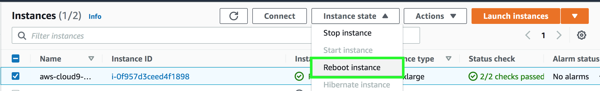
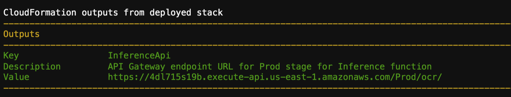
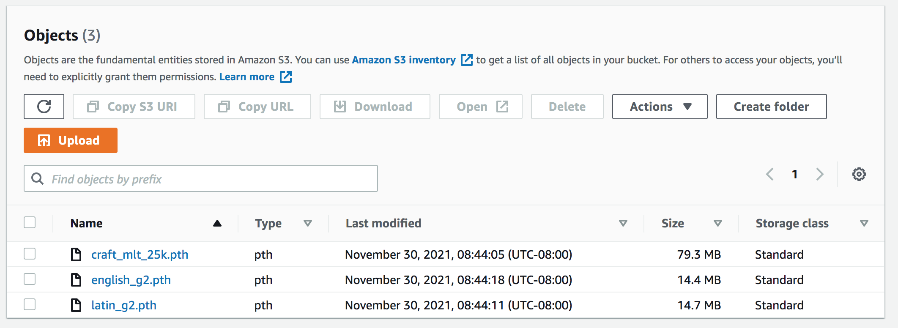

# Deploy multiple machine learning models for inference on AWS Lambda and Amazon EFS
In this guide, you will find the steps needed to deploy an OCR application on AWS Lambda to perform inference on images in different languages and use Amazon EFS for model management. 

## Services Used 

Services used in this demo:
1) AWS Lambda
2) Amazon EFS
3) API Gateway 
4) CloudFormation
5) AWS Serverless Application Model (AWS SAM)

## Application Workflow 

Here is the architectural workflow of our application:

- Create a serverless application that will __trigger__ a Lambda function upon a new model upload in your `S3 bucket`. And the function would copy that file from your S3 bucket to `Amazon EFS File System`.

- Create another Lambda function that will load the model from `Amazon EFS` and performs an __inference__ based on an image.

- Build and deploy both applications using  `AWS Serverless Application Model (AWS SAM)` application.

# Architecture 

The following diagram illustrates the solution architecture:


# Stages

**Stage 1** Create a new Cloud9 Instance by following these steps. 

1) Select Cloud9 in AWS Console in N.Virginia

2) Select Create environment 

3) Enter environment name as reInventOcrDemo

4) Under Configure settings, select 

    Environment type as: `Create a new EC2 instance for environment (direct access)`

    Instance type as: `Other instance type -> m5.2xlarge`
    
    Platform as `Amazon Linux 2`

    and click next. 

7) Review Environment name and settings and click on create environment. Cloud9 will boot up a development environment in a few minutes. 

**Stage 2** Use SAM CLI to build the application. Follow these steps. 

1. Fetch the EBS Volume ID and increase EBS volume to 30GB by running: 

    ```
    INSTANCE_ID=$(curl -s http://169.254.169.254/latest/meta-data/instance-id)

    VOLUME_ID=$(aws ec2 describe-volumes \
    --query "Volumes[?Attachments[?InstanceId=='$INSTANCE_ID']].{ID:VolumeId}" \
    --output text)

    aws ec2 modify-volume --volume-id $VOLUME_ID --size 30
    ```

2. To ensure that our environment makes use of the newly allocated space, we would have to reboot the instance.
- Open a new tab and navigate to the EC2 console.
- Select the instance, and click on Instance State dropdown. 
- Click on `Reboot Instance`.



- Navigate to Cloud9 and click on `Open IDE`
- Now we are ready to build and deploy the application. 

3. Type in the terminal: `sam init`

4. Select Custom template location and type: 
```
https://github.com/aws-samples/ml-inference-using-aws-lambda-and-amazon-efs.git
```

5. The template uses Python 3.8. Install that in your environment using: 

```
sudo amazon-linux-extras install python3.8
```

6. Build the application with SAM using `sam build`. 

    You might see a few warnings, but the build process will complete. Once finished, you will see Build Succeeded in the terminal. If the build fails, get some assistance from the presenters. 

**Stage 3** Deploy the CloudFormation stack with SAM following these steps.

1. Use guided deployment with SAM by using `sam deploy --guided`

2. Use stack name as `reinventdemo`

3. Use AWS Region as `us-east-1`

4. For Parameter SrcBucket, create a unique bucket name. We will use the last 4 digits of your phone number to make the bucket name unique. 
`reinventdemobucket-<PHONE_NUMBER_DIGITS>`

5. Select Yes for the next set of prompts:
    - Confirm changes before deploy - Y
    - Allow SAM CLI IAM role creation - Y
    - InferenceFunction may not have authorization defined, Is this okay - Y
    - Save arguments to configuration file - Y

6. Press Enter to select default for for `SAM configuration file [samconfig.toml]`

7. Press Enter to select default for `SAM configuration environment [default]`

SAM should start the deployment process by uploading your container image to Amazon ECR and set-up the stack. 

8. Select yes for `Deploy this changeset?`

9. Once the stack is setup, you will receive an InferenceApi endpoint. We will use this endpoint to make inference requests later. 



**Stage 4** Upload Language Model to S3

1. Download the text detection and language model from EasyOCR. 
    - [craft_mlt_25k](https://github.com/JaidedAI/EasyOCR/releases/download/pre-v1.1.6/craft_mlt_25k.zip)

    - [English](https://github.com/JaidedAI/EasyOCR/releases/download/v1.3/english_g2.zip)

    - [French](https://github.com/JaidedAI/EasyOCR/releases/download/v1.3/latin_g2.zip)

2. Unzip the models, so they are extracted as .pth files and upload them to the newly created S3 bucket. 

3. Once uploaded, your S3 bucket should look like this



**Stage 5** Make Inference request

1. Make this curl request using the endpoint that was created in Stage 3 Step 9.  The first image we will extract text from is an English image.


```
curl -X POST \
  [YOUR_ENDPOINT_HERE] \
  -H 'cache-control: no-cache' \
  -H 'postman-token: 9566069a-e7ce-bf1e-9a5e-043b73f9faf0' \
  -d '{
"link": "https://demo622.s3.amazonaws.com/english-1.png", 
"language": "en"
}'
```
You should get an inference response with the predicted label. 

2. You can try different languages by changing the language code. Try this request for extracting text from a French Traffic Sign.


```
curl -X POST \
  [YOUR_ENDPOINT_HERE] \
  -H 'cache-control: no-cache' \
  -H 'postman-token: 9566069a-e7ce-bf1e-9a5e-043b73f9faf0' \
  -d '{
"link": "https://www.maisonlaudiere.com/s/cc_images/teaserbox_460639.jpg", 
"language": "fr"
}'
```

# Summary
In this workshop, you deployed a multi-model inferencing endpoint using AWS Lambda and Amazon EFS. 

When you upload your models to S3, an AWS Lambda function gets triggered and loads the models into an Amazon Elastic File System that is mounted on a second AWS Lambda function that is connected to an API gateway endpoint to perform optical character recognition on images in multiple languages. When an inference request is sent, based on the language specified, the Lambda function fetches the appropriate language model from mounted EFS and uses that to produce a `predicted_label`. 

This pattern simplifies your model management using Amazon EFS while providing benefits of Serverless ML in terms of pay-for-use, simple programming model, and reduced operational overhead.


# Demo walkthrough

Here is a quick walkthrough of the demo:

https://user-images.githubusercontent.com/56056673/131384905-4fc5cfbd-9251-4cbf-ba21-287808566073.mp4
